# Did hydration breaks really kill momentum at the 2026 World Cup?

*A tournament-wide analysis suggests the television clock exaggerated the immediate lull,
dominant teams usually cooled off anyway, and the clearest effects were on coaching,
scheduling and perception.*

**By Reza Baghestani**
Based on repository v2.0.0 · 27 July 2026

> **Bottom line:** The breaks were not a reliable momentum switch. They were a *rhythm*
> switch — changing coaching, scheduling, broadcasting and perception far more consistently
> than they changed the next several minutes of shooting.

---

## The complaint

> "I think that it interrupts and changes the identity of a football match much more than I
> thought."
> — **Thomas Tuchel**, England manager, speaking during the tournament (Goal.com)

He was describing the 2026 World Cup's new universal hydration breaks: roughly three
minutes near the middle of each half, in every match, whether the evening was oppressive or
mild. No tournament had done this before.

The complaint was easy to understand. A team would spend several minutes pinning an opponent
back, the referee would stop the game, coaches would gather their players, and the match
would restart with a different rhythm. Television momentum graphics visibly sagged during the
pause. When the other team improved afterwards, the story seemed complete: the break killed
the pressure.

But momentum is a genuinely difficult thing to measure, and three problems sit in front of
anyone who tries.

Strong attacking spells usually end even when nobody stops the match. The game clock keeps
running during a hydration break, so a naive "eight minutes after" window may contain only
five minutes of football. And the famous examples are not a random sample — nobody writes an
article about the dozens of breaks followed by entirely ordinary play.

So I built a reproducible analysis of **203 recorded mandatory hydration breaks across 102
matches**, with the specification frozen before I computed a single outcome. The answer is
more interesting than either side of the argument.

---

## A new rule, applied almost everywhere

FIFA mandated one break in each half of every match. They did not begin exactly at the
nominal 22nd and 67th minutes: referees waited for a natural stoppage, producing modal start
times of 23' and 68'.

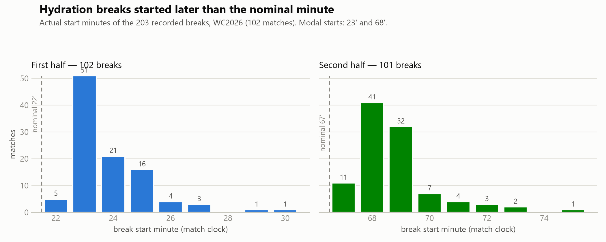

*When the breaks actually happened. Referees waited for a natural stoppage, so the
distribution sits just after each nominal minute.*

The weather context is part of the controversy. I estimated wet-bulb globe temperature at
each break and found a median of **26.1 °C**. Only **38 of 203** breaks occurred at or above
32 °C — the threshold identified in secondary reporting as FIFA's former mandatory
cooling-break trigger. FIFPRO, the players' union, is more cautious, recommending cooling
breaks above roughly 26 °C and match delays above 28 °C.

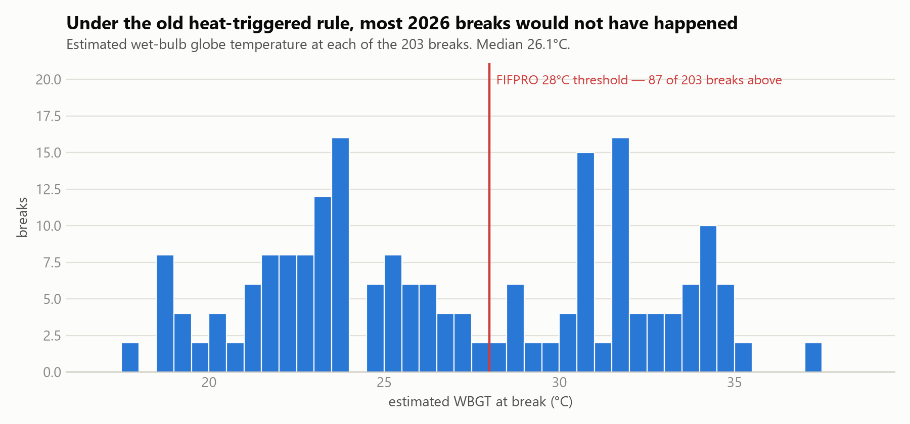

*Most breaks happened below the former 32 °C mandatory threshold cited in secondary
reporting. FIFPRO recommends action at considerably lower heat-stress levels.*

So the policy should not be reduced to "unnecessary breaks." The governing body and the
players' union genuinely disagree about where danger begins, and that disagreement is not
settled by shot data. What is clear is that this was a **universal scheduling rule**, not an
emergency response to the hottest matches.

---

## Two traps: the clock, and the counterfactual

Before interpreting any result, two problems had to be solved.

**First, the clock.** The official match clock keeps running while players are drinking. If
an eight-minute post-break window begins when the referee calls the break, roughly three of
those minutes contain no football at all. I therefore computed every outcome on two clocks: a
**display clock** (what a viewer or an event feed sees) and a **break-adjusted clock** that
removes hydration dead time *and only that* — throw-ins, VAR checks and injuries stay in,
because they are ordinary football.

**Second, the counterfactual.** A before-versus-after comparison is not enough, because teams
that have just produced an intense spell tend to cool off naturally. Each real break was
compared against eligible ordinary minutes from the same match and half, matched on game
state and screened away from goals, red cards, VAR reviews, half boundaries and the real
stoppage itself. Uncertainty is clustered by match, because the two breaks in one match are
not independent observations.

The primary outcome is deliberately modest: the absolute change in the home−away shot
differential across the window. It measures whether the *balance* of shooting became unusually
scrambled. It does not claim to measure psychology, territory, line height, or every dimension
of what people mean by momentum.

---

## The dramatic shot drought was largely a clock illusion

On the display clock, the breaks look damaging. The probability of at least one shot in the
next eight displayed minutes was **0.689**, against **0.787** at matched ordinary moments.

Remove the hydration dead time and the same probability rises to **0.818** — slightly *above*
the same 0.787 benchmark.

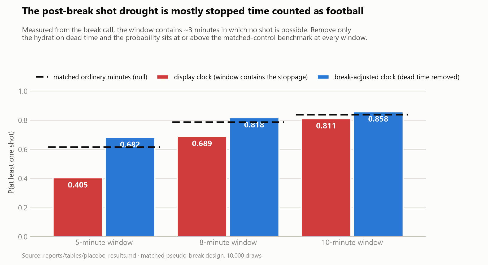

*The apparent post-break drought, and what happens when you stop counting stopped time as
football.*

I wanted to be sure this was the whole explanation rather than a convenient one, so I ran the
reverse experiment. Take ordinary passages of football — no break, nothing unusual — and
insert an artificial stoppage into the clock using each real break's own measured duration.
Nothing is deleted; no quiet periods are cherry-picked; only elapsed time is inserted.

**The collapse reappears.** Fake stoppages inserted into ordinary football reproduce most of
the decline that real hydration breaks appeared to cause.

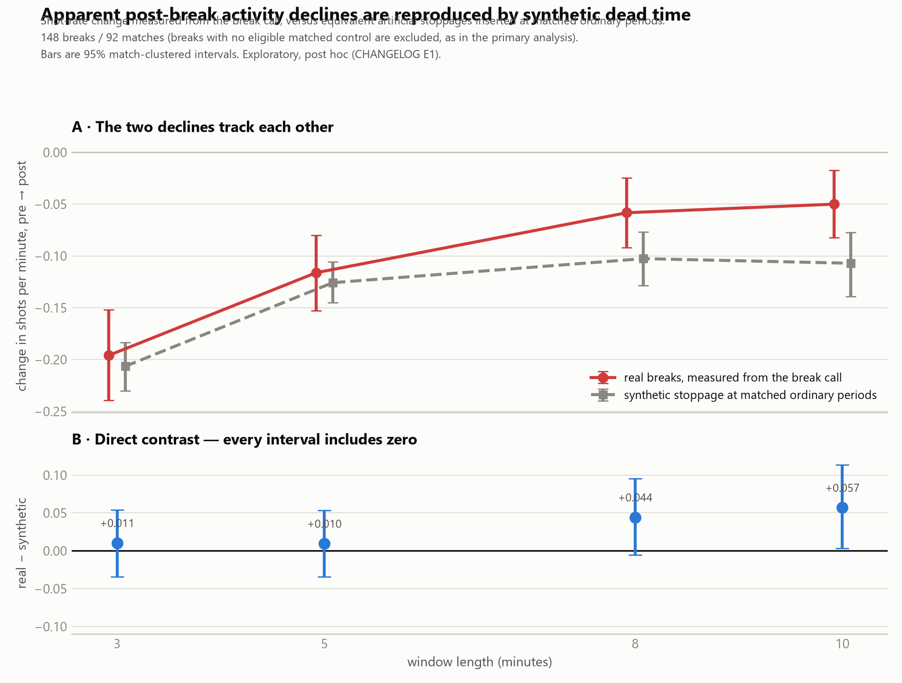

*Shot rate aligned to the break call and to the resumption. The dive is in the display-clock
alignment, not in the football either side of it.*

This generalises well beyond drinks breaks. Any time you define an event window on a displayed
clock that contains a stoppage — substitutions, VAR reviews, injuries, goal celebrations — you
will measure a suppression that is partly or wholly an accounting artifact. I would not have
caught it if the specification hadn't forced me to define the clock precisely before looking
at any outcome.

Honesty requires one qualification. The exploratory decomposition found small *positive*
post-resumption differences at some longer windows, and the synthetic-stoppage comparison did
not perfectly reproduce the real sequence at ten minutes. The responsible claim is narrower
than "it's all the clock": the large television-clock collapse is not, by itself, evidence
that attacking football was suppressed.

---

## The primary test: no detectable disruption — with one uncomfortable caveat

For the primary eight-minute analysis, **183 breaks across 101 matches** had at least one
clean matched control. The estimated effect was **−0.073 shots, 95% match-clustered CI
[−0.258, +0.116]**.

Negative means real breaks were followed by slightly *less* disruption than their controls —
the opposite of the complaint. The interval includes zero. In ordinary language: the analysis
did not detect a tournament-wide increase in shot-balance disruption after hydration breaks.

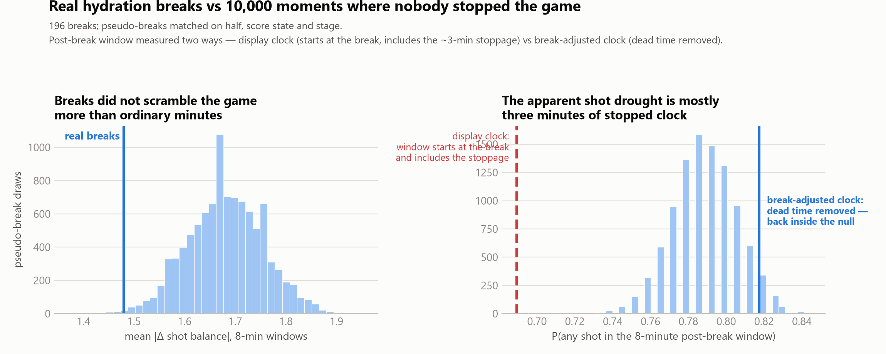

*Real breaks against 10,000 comparable moments where nobody stopped the game.*

The repository does not hide the least convenient robustness result. Requiring deeper control
support moves the estimate steadily more negative: **−0.173** with at least three controls,
**−0.196** with at least five, and **−0.948** with at least ten. That last figure excludes
zero.

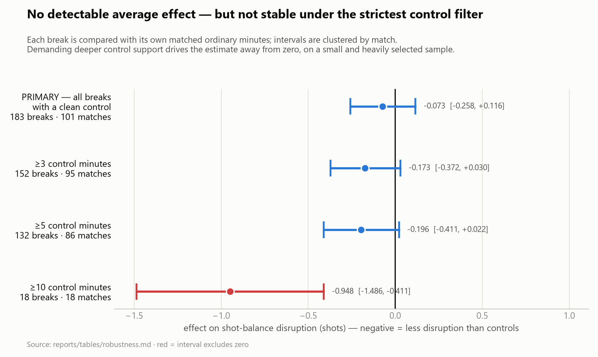

*The primary estimate, and what happens when you demand progressively more clean comparison
minutes per break.*

But it rests on only **18 highly selected breaks**. After contaminated controls were removed,
the matches able to supply ten valid alternatives were unusually quiet and structurally
simple — few goals, few cards, stable score state — and in a quiet match a hydration break is
a much larger share of everything that happens. That pattern may be selection, a real subgroup
effect, or both. This design cannot fully separate them.

The caveat changes the strength of the claim, so it travels with it: the evidence supports
*no detectable average effect in the main sample*, not *the effect is zero under every
reasonable specification*.

---

## What if the attacking team — not the whole match — lost momentum?

The strongest objection to a total-activity analysis is straightforward: a match can stay
active while momentum changes sides. A team might lead the pre-break shot count 5–0 and lose
the post-break period 1–4. Total shots barely move, but the attacking advantage has collapsed.

The directional test addresses exactly that claim. For each break, the attacking side is
identified using **only pre-break information**, then held fixed. Each break is matched to
ordinary moments in the same match and half that began with the same pre-window shot
advantage — because dominant spells regress even without a stoppage.

The attacking side did cool off after real breaks, giving back **−1.091** shots of advantage
over the following five minutes. The complaint appears vindicated.

Except that comparable uninterrupted spells produced **−0.955** over the same span, with no
break at all.

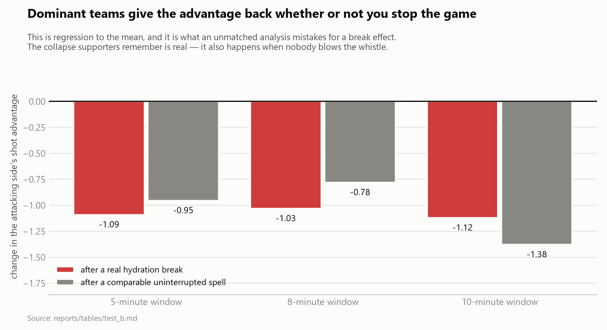

*The collapse is real. It is also what intense attacking pressure normally does next.*

The additional break-associated difference was **−0.136** shots at five minutes, **−0.251** at
eight and **+0.258** at ten. Every confidence interval crossed zero.

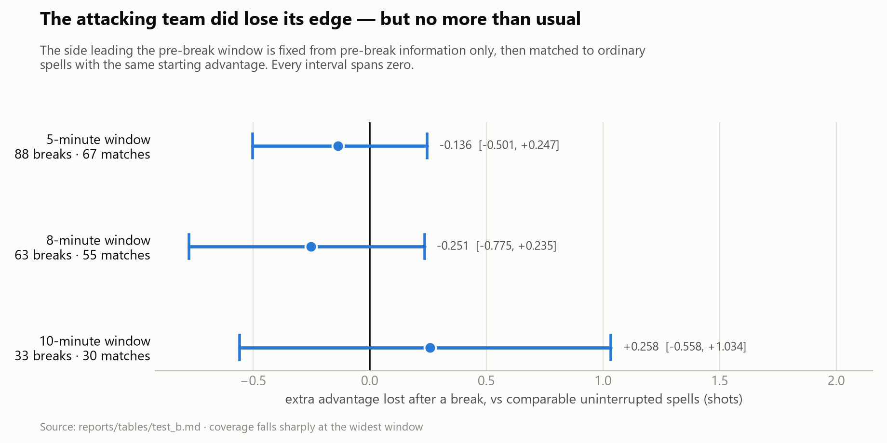

*Extra advantage lost after a break, beyond what comparable uninterrupted spells lose anyway.*

This is not proof that a small effect does not exist. Coverage falls from 88 matchable breaks
at five minutes to 33 at ten, and the intervals still permit effects that could matter in an
individual match. What the evidence does show is that the familiar collapse is **not unique to
the break**. Much of what supporters call momentum being killed is simply what happens next
after a siege — regression to the mean, which an unmatched analysis would confidently have
misreported as a hydration-break effect.

---

## The clearest change was managerial

The breaks did not produce an excess of substitutions. Only **18.7%** of second-half
substitutions occurred within three minutes of their own match's break, against minute-matched
historical expectations of **19.6%** (2018) and **20.7%** (2022). Slightly *below*, not above.

The pattern underneath that total is the revealing part: a deficit in the three minutes
**before** the stoppage (6.8%) and a surplus in the three minutes **from the restart** (15.0%).

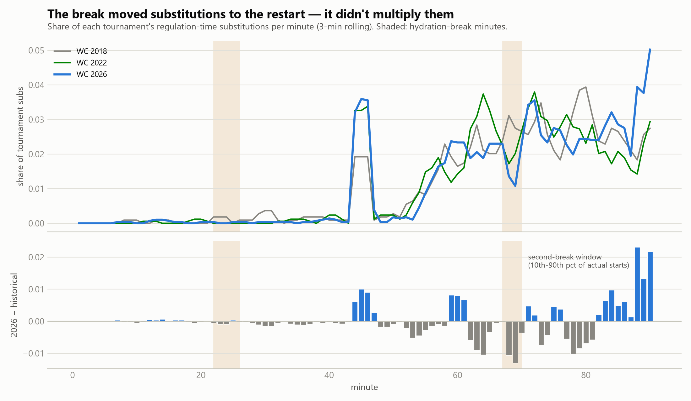

*Coaches did not make more changes. They made the same changes three minutes later, using the
guaranteed meeting to brief the player first.*

The fresh-legs data fit that reading without proving any physiological benefit from the break
itself. Players introduced at the stoppage produced far more high-speed output than the
starters they replaced — 66.3 sprints per 90 against 45.7 — as substitutes generally should.

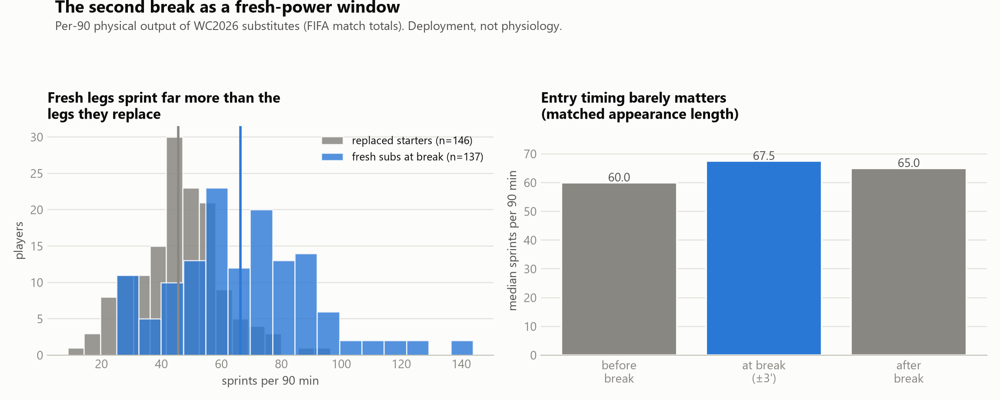

*Fresh legs versus the legs they replaced. The gap is large — and it is a substitution effect,
not a hydration effect.*

When appearance length is matched, entering just before, at, or after the break made little
difference. The break was a **coordination point**, not a demonstrated performance treatment.

Matches also got structurally longer. Two breaks sit inside the clock and are added back as
stoppage time, so 2026 matches carry roughly six mandated extra minutes on top of an already
stretched environment.

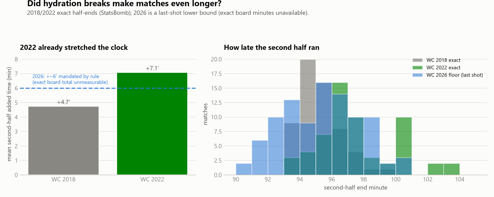

*Second-half length across three tournaments. Exact 2026 board minutes are absent from every
auditable source, so 2026 is reported as a floor, never as a board figure.*

---

## Why the breaks felt decisive

I also tested the public narrative rather than treating it as noise. Claims were collected,
verified against their original sources, and then evaluated **blind to the claim text** — only
the match, the break and the team said to benefit were read.

Among **12 unique breaks** that attracted a verified, testable claim, **7 were supported**.
At claim level, 8 of 16. Commentators and managers were not simply imagining swings.

The denominator tells the other half of the story. In a stratified random sweep, only **4 of
48 sampled breaks** had any located public claim — 8.3%, with a wide interval from 3.3% to
19.6%.

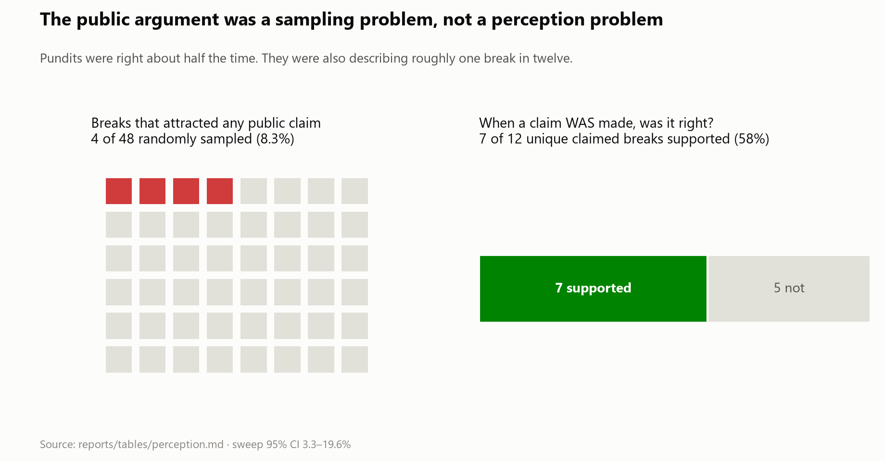

*Pundits were right about half the time. They were also describing roughly one break in
twelve.*

That is availability bias in football form. A dramatic comeback after a break becomes evidence
about the rule. An identical swing with no commentary disappears. A quiet restart never becomes
a story at all.

The tournament's most-discussed break is a good illustration. Tuchel, describing England
against DR Congo, said:

> "After the first water break we had three, four, five big chances, a penalty situation maybe
> in our favour, we kept knocking, kept knocking, knocking, knocking."
> — **Thomas Tuchel** (TNT Sports)

That break drew three separate published claims — more coverage than any other in the dataset.
Measured against its own match-half's ordinary minutes, the shot-differential swing sat at the
43rd percentile: **entirely unremarkable**, and not supported.

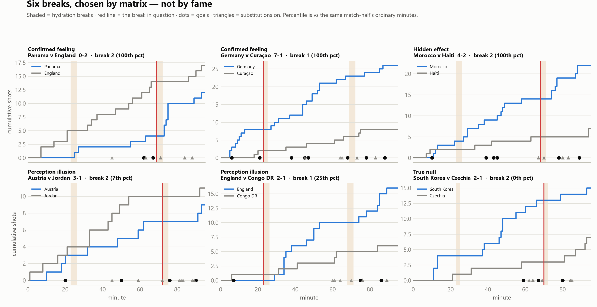

*Selected breaks across the two-by-two of large/small swing and claimed/unclaimed. The
unclaimed cells are not empty — they are simply never discussed.*

---

## The commercial question

The loudest charge was commercial: that FIFA interrupted football to sell advertising. My data
can measure the inventory. It cannot measure intent. So it does the first and refuses the
second.

The 203 recorded breaks account for **580 minutes — about 9.7 hours** of in-match stoppage,
roughly 5.7 minutes per match. Tournament-wide, the policy guarantees 208 slots across 104
matches: an arithmetic ceiling of **up to approximately 10.4 hours**.

Three properties make that commercially distinctive, and all three follow from the policy plus
my own timing data. It is **guaranteed** — every match, both halves, regardless of weather.
It is **predictable** — clustered at 23' and 68', so it can be scheduled and sold in advance
rather than filled reactively. And it is **inside the match** — the clock runs and the time is
added back, so the audience does not disperse as it does at half-time.

That combination is genuinely different from ordinary stoppage. It is also a structural fact,
not an accusation. **No dataset in this project speaks to why FIFA created the rule.** FIFA
presented it as a player-welfare measure; Gianni Infantino said that *"what matters even more
to us is ensuring that all teams in every match are playing under the same conditions"* and
publicly denied a financial motive. I did not audit broadcast revenue, did not code a single
advertisement, and hold no contract or ratings data. Both things can be true at once: the
pauses created a broadcast asset that did not previously exist, and that fact establishes
nothing whatever about motive.

---

## What I got wrong

I want to be specific about this, because it is the part that should determine how much you
trust the rest.

**I found a strong result and deleted it.** An early analysis showed home teams gaining shot
advantage after breaks. It survived every robustness check I threw at it. Then I checked
whether the *control pool itself* was balanced — and it wasn't. The comparison minutes carried
a systematic drift with nothing to do with hydration breaks. The result was an artifact of my
own control construction, and it is documented in the changelog rather than quietly dropped.

**I shipped a real bug.** My control minutes were supposed to represent ordinary,
uninterrupted football. Because I screened only the *anchor* minute rather than the whole
window, **46.8%** of controls at the primary window actually contained the real hydration
break. My "uninterrupted" comparisons were contaminated with the treatment. Fixing it cut
sample sizes substantially and widened every interval. The conclusions survived; the confidence
I could claim in them did not, and the published numbers now reflect that.

**I nearly published a spectacular false positive.** Goals looked like a better outcome than
shots — more meaningful, well time-stamped, and more numerous than cards. Break windows contain
**0.227** goals per eight minutes; matched control windows contain **0.054**.

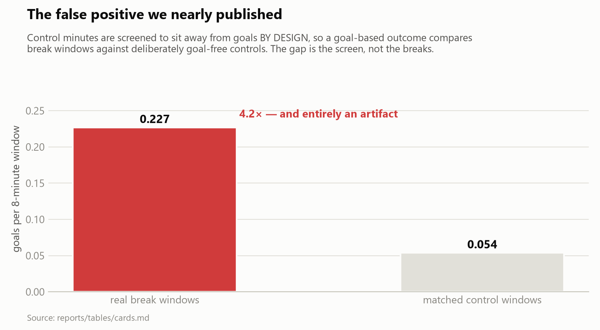

*A four-fold difference that is entirely an artifact of my own control screen.*

Control minutes are screened to sit away from goals *by design*, so a goal-based outcome
compares break windows against deliberately goal-free controls. The gap is the screen, not the
breaks. I caught it by checking the mechanism before believing the number. That one would have
been very difficult to walk back.

---

## What this study cannot answer

The analysis is shot-based, because no independently auditable per-shot xG layer exists for the
tournament. FIFA's public post-match reports contain rich tactical summaries — line height,
team length, pressure, passing networks — but no time-resolved pre/post-break values. Every
page of six such reports was checked. The study therefore cannot test whether defensive lines
dropped, whether spacing changed, or whether a coach's instruction altered possession structure.

The design is observational. Breaks were not randomly assigned, and the analysis asks whether
post-break football was unusual relative to available controls — not whether the break *caused*
every difference. Exact restart timestamps are unavailable, so minute-level transition bins
carry measurement noise.

And no physiological claim is made anywhere. Whether the breaks protected players is a medical
question that public event data cannot answer, and it is the question that matters most.

---

## Conclusion: a rhythm switch, not a momentum switch

The evidence supports neither extreme version of the story.

It does not support the claim that hydration breaks consistently destroyed the attacking team's
momentum. The largest immediate shot drought was mostly a clock artifact. When the analysis
followed the team that had been attacking, its advantage usually declined — but not detectably
more than after similar uninterrupted spells. In the main matched sample, shot balance after
breaks was not unusually disrupted.

It would be equally wrong to say nothing changed. Football at the 2026 World Cup acquired two
scheduled meetings inside every match. Coaches moved substitutions to the restart. Broadcasters
gained predictable, guaranteed, mid-match stoppages. And audiences watched momentum graphics
decay during dead time, then judged a universal rule from the handful of breaks that happened
to be followed by something memorable.

The most accurate conclusion is that the breaks were not a reliable momentum switch. They were
a **rhythm switch**: a new institution inside the match, changing how football is managed,
narrated and sold far more consistently than it changed the next eight minutes of shooting.

That distinction matters for whatever FIFA decides next. A welfare intervention should be
judged on medical evidence that public event data cannot supply. A sporting intervention should
be judged with clocks that don't count stopped time as play, and controls that respect
football's natural regression. And a permanent rule deserves to be debated as more than a
drinks break — because two guaranteed time-outs per match alter the structure of the sport even
when the average effect on the scoreboard is small.

---

## Data and source notes

1. Project repository, frozen specification, dated amendment log and full technical report:
   Reza Baghestani, *Did hydration breaks change the 2026 World Cup?*, v2.0.0 —
   [github.com/rezaba002/WC2026-HydrationBreakAnalysis](https://github.com/rezaba002/WC2026-HydrationBreakAnalysis)
2. FIFA, *Players to benefit from hydration breaks at FIFA World Cup 2026*.
3. FIFPRO, *Guidelines and mitigation strategies for hot conditions in professional football*.
4. Independent preprint on the same question, replicated here by a different route:
   arXiv:2607.19783.
5. Manager and administrator quotes: Goal.com and TNT Sports, each re-read against its source
   URL on 2026-07-25 and recorded in `data/manual/`.

**A note on the numbers.** Every figure quoted in this article is generated from the analysis
tables rather than transcribed by hand, and the repository's test suite fails the build if this
text and the computed results disagree. Three collected quotes could not be located at their
cited sources and are excluded from every figure and table. The 32 °C historical FIFA threshold
is cited from secondary reporting; it should be verified against a primary regulation document
before any formal academic submission.
