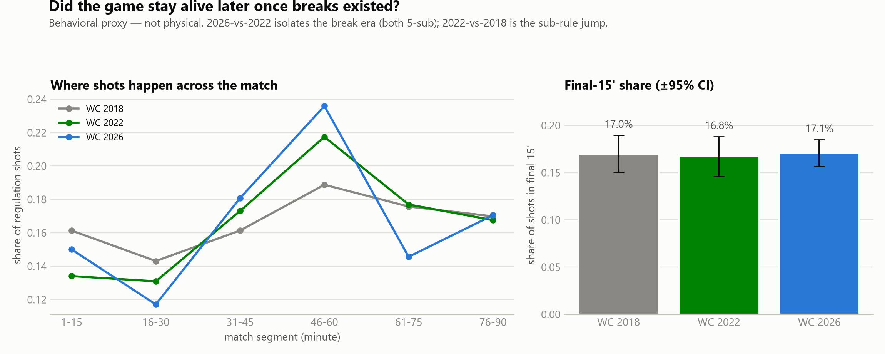

# Did hydration breaks change the 2026 World Cup?

**A reproducible analysis of 203 mandatory breaks across 102 matches**

Version 1.0 · 2026-07-25 · [github.com/rezaba002/WC2026-HydrationBreakAnalysis](https://github.com/rezaba002/WC2026-HydrationBreakAnalysis)

Every figure in this report is generated by a script from audited source data. Nothing
was measured after the analysis specification was frozen; the two amendments that were
made are dated and justified in `CHANGELOG.md`.

---

## 1. The question

The 2026 World Cup was the first to mandate hydration breaks in **every match regardless
of weather** — roughly three minutes near the 22nd minute of each half. Previously,
cooling breaks were triggered only by a heat threshold. Football was, in effect, divided
into four quarters.

The breaks were immediately controversial. Managers said they changed the identity of the
game. Commentators narrated momentum swings around them. Broadcasters sold them.

This report asks one question:

> **Did the universal hydration-break policy measurably change attacking performance —
> and if the average effect was small, why were the breaks so widely experienced as
> decisive?**

The interesting possibility is not that one side of that is wrong. It is that both are
true at once: a near-zero average effect coexisting with real, measurable changes to how
football was coached, staffed, timed and narrated.

---

## 2. What the breaks actually looked like

Before testing anything, the basic facts.


Breaks did not happen at the nominal minute. They clustered at **23'** and **68'**, with
a tail out to 30' and 75' — referees waited for a natural stoppage. Of 203 recorded
breaks, 102 were first-half and 101 second-half. (One half, France–Iraq's second, has no
recorded break in any source we hold; it is documented, not silently dropped.)

This matters for measurement: an analysis anchored to 22'/67' would misplace most breaks.
All results here use each match's **actual** break minute.


The heat context explains why the policy was contested. Estimated wet-bulb globe
temperature at the breaks ranged from 17.8 °C to 37.2 °C, median 26.1 °C. **Only 87 of
203 breaks (43%) occurred above the 28 °C FIFPRO threshold** that would have triggered a
cooling break under the old rules. The majority of 2026's breaks would simply not have
happened before. This is a policy change, not a weather event — which is precisely why
its effects are worth measuring.

---

## 3. How the effect was measured

Two design decisions carry the whole analysis.

**The clock problem.** The match clock runs during a break. A naive "10 minutes before
versus 10 minutes after" comparison therefore gives the *after* side about three fewer
minutes of actual football. Every result below is computed on two clocks: the **display
clock** (what viewers and event feeds see) and the **break-adjusted clock** (hydration
dead time removed — and only that; throw-ins and VAR remain, so it is not an "active
play" clock and is never described as one).

**The counterfactual problem.** Comparing before-and-after tells you nothing on its own,
because football is volatile: dominance decays, pressure reverts to the mean. The test
must be *versus what normally happens*. For each real break we enumerate eligible
non-break minutes in the same match and half, matched on score state and stage, excluding
minutes near goals, red cards, VAR reviews and half boundaries — then draw 10,000
randomized pseudo-breaks and compare the real result against that null distribution.

Primary outcome is **balance disruption**: the absolute change in shot differential
across the break, |Δ(home − away)|. It is direction-agnostic, so it can be scored for
every break, and it is always defined — unlike shot *share*, which is 0/0 in the many
quiet windows. Uncertainty is a match-level bootstrap (5,000 iterations, fixed seed),
because two breaks per match are not two independent observations.

> **A note on what is not here.** Per-shot xG does not exist in any independently
> auditable source for this tournament. FIFA's official post-match reports publish
> shot logs without xG; FBref blocks automated access. Outcomes are therefore
> shot-based (CHANGELOG A2). This is stated rather than papered over.

---

## 4. The seductive result, and its correction


**On the display clock, the breaks look devastating.** The probability of any shot in the
8 minutes after a restart falls to **0.658**, against a null of ~0.80 — far outside the
range of ordinary matched minutes. If you stop there, you have a headline: hydration
breaks kill momentum.

**Remove the three dead minutes and it vanishes.** On the break-adjusted clock the same
probability is **0.806** against a null of **0.822** — squarely inside the null
distribution. The entire "momentum kill" was the stopped clock being counted as football.

The primary metric agrees. Balance disruption after real breaks was **1.556**, against a
matched-minute null of **1.641** — real breaks scrambled the game *slightly less* than
ordinary moments did. Under placement matching (controls restricted to ±5 minutes of each
break's own minute) the gap widens in the same direction: **1.456 versus 1.649**.

**The average competitive effect is null.** This replicates the existing preprint
(arXiv 2607.19783) by an independent route, and the older momentum-index audit agrees:
treated breaks showed a mean momentum drop of 7.91 versus 7.11 at historical control
minutes — a difference of +0.80 with a 95% interval of [−2.11, +3.85], straddling zero.

### A result we deleted

The analysis initially produced a strong directional finding: home teams gained shot
differential after breaks (+0.29 after placement matching, with essentially no null draws
reaching the observed value). It survived every robustness test applied to it.

It is not reported as a finding, because the control pool itself is biased for
directional contrasts. All unfiltered eligible minutes average **+0.040** — essentially
zero, as symmetry demands. The score-state-matched control pool averages **−0.134**, and
is negative in *all three* score-state buckets. That is impossible for a clean control: a
baseline tracking game state would be negative when the home side leads and sits back, and
**positive** when it trails and chases. The cause is the preregistered goal-proximity
screen, which strips disproportionately many home-pressure phases out of the controls
while real breaks sample them at the natural rate.

The headline is unaffected — the primary metric is absolute, and the same bias runs
*conservative* there. Full evidence: `reports/tables/robustness.md`; limitation logged as
CHANGELOG A5.

### Does the null hold up?

| check | result |
|---|---|
| Leave-one-match-out (102 refits) | gap stable in [−0.224, −0.158]; no single match drives it |
| Drop windows containing a red card | 1.456 vs 1.649 — unchanged |
| Drop breaks with a goal in the prior 3' | 1.442 vs 1.664 — unchanged |
| Nominal 22'/67' timing instead of actual | 1.549 vs 1.608 — unchanged |
| Group vs knockout stage | 1.458 vs 1.711 · 1.451 vs 1.520 — both below null |
| Windows of 5 / 8 / 10 minutes | consistent throughout |

One exploratory exception, flagged and not claimed: the halves diverge. First-half breaks
are markedly *less* disruptive than matched minutes (1.10 vs 1.59), while **second-half
breaks are the one subgroup sitting above its null** (1.87 vs 1.72). That is coherent with
the substitution evidence below — but it is one subgroup cut among several and needs
preregistration before it can be a claim.

---

## 5. What did change

The competitive null is only half the story. Several things about World Cup football did
measurably change.

### Substitutions moved — they did not multiply


The intuitive test fails. Only **18.7%** of 2026 second-half substitutions fell within ±3
minutes of their own match's break — *below* the minute-matched historical expectation
(19.6% from 2018, 20.7% from 2022). The break did not become a substitution magnet.

The displacement pattern underneath it is the real finding (exploratory, not
preregistered): a **deficit in the three minutes before the stoppage** (6.8% vs 7.6/8.5%
historically) and a **surplus in the three minutes after the restart** (15.0% vs
12.6/14.6%). Coaches did not make more changes; they waited for the break and made them at
the restart. The break became a scheduling point.

Context: 2026 averaged 4.64 regulation substitutions per team-match against 4.39 in 2022
and 2.87 in 2018 — the jump is the five-substitution rule, not the breaks. Median first
substitution: 58' (2026), 57' (2022), 61' (2018).

### The break as a fresh-power window


FIFA's per-player physical data allows one legitimate question — not whether breaks
refreshed players (that is unmeasurable here), but **whether coaches used them to inject
fresh legs**.

Substitutes entering at the break ran at **66.3 sprints per 90** against **45.7** for the
starters they replaced; high-speed running 162 vs 121, high-speed distance 1,245 m vs
806 m. Fresh legs are dramatically more explosive than tiring ones — as expected.

Honesty check: entry *timing* barely matters. Restricted to a matched ≤30-minute
appearance band, median sprints/90 are 60.0 before the break, 67.5 at it, 65.0 after —
the timing differences largely collapse. The fresh-versus-tired gap is the story; the
break's role is that it is where the swap gets coordinated.

### Matches got longer — but 2022 got there first


Qatar 2022 was the added-time anomaly: second halves ran to **97.1'** on average (+7.1),
against **94.7'** (+4.7) in 2018. 2026 adds roughly six minutes per match **by rule**,
since the breaks sit inside the clock.

Whether 2026's boards *exceeded* the already-inflated 2022 environment cannot be
determined: exact added-time minutes are absent from every auditable source we hold (the
FIFA feed strips stoppage notation in 97 of 104 matches). We report a last-shot lower
bound and no more. Late scoring shows no clean trend either — goals at ≥90' were 11.4%
(2018), 8.9% (2022), 12.6% (2026).

### Did the game stay alive later?



The physical-recovery question — did breaks help players sustain the game? — cannot be
answered directly: no per-player physical data exists for 2018 or 2022, and 2026's data
are match totals with no pre/post-break split. (This was searched and confirmed, not
assumed.)

The available proxy is behavioral: the share of shots in the final 15 minutes. It is
**flat across all three tournaments** — 17.0% (2018), 16.8% (2022), 17.1% (2026), with
overlapping confidence intervals. Whatever the breaks did, they did not visibly change how
alive the closing stages were.

---

## 6. Why it felt different

If the average effect is null, the perception needs explaining. This is where the project
departs from prior work.

We preregistered an inclusion rule — a claim counts only when a commentator, manager,
player or major outlet attributes a change in a **specific match** to a **specific
break** — then collected. The pilot found **13 usable claims covering 11 breaks**, from
Opta Analyst, Goal.com, Middle East Eye and The Times, with 12 candidates rejected and
logged. Each was then evaluated **blind to the claim text**: only the match, the break and
the team said to benefit were read, and the swing was scored against that same match-half's
own pseudo-break null.

**Six of eleven testable claims were supported.** The people making these claims were
largely right.

That is the finding, and it is not the one we expected. The bias is not in the claims. It
is in the **denominator**:

> Claims were made about **11 of 203 breaks — about 5%**. Within that tiny, self-selected
> set, the claims are usually accurate. Pundits were describing real swings. They were
> simply describing them from the tail of a distribution, and the tournament-wide story
> was then written from that tail.

The case-study matrix makes the asymmetry concrete. Scoring every break on swing size and
crossing it with whether anyone discussed it:

| | large swing | small swing |
|---|---|---|
| **publicly claimed** | 2 | 4 |
| **no claim in pilot** | 65 | 73 |


Cases were selected by this matrix, not by fame. Germany–Curaçao and Netherlands–Sweden
qualified on merit at the 100th percentile; Switzerland–Bosnia, a planning-stage
favourite, did not.

The decisive case is **Panama–England, second break**. Before it, Panama had 1 shot to
England's 3. After it: Panama 6, England 0 — the largest pressure inversion in the
tournament. Nobody wrote about it, because Panama still lost 0–2. Meanwhile Austria–Jordan,
which *did* generate public claims, sits at the **7th percentile** — the swing people
remembered was smaller than a typical quiet passage of that same half.

Large post-break swings were common. Commentary about them was not. What determined
whether a swing became a story was whether the scoreboard followed.

*Caveat: the pilot was a topical search across four outlets, not the per-match sweep the
codebook requires for full collection. "No claim" means "none surfaced in the pilot". The
direction of the asymmetry is solid; its exact size will move.*

---

## 7. Conclusion

**Hydration breaks did not, on average, change who created the next chance.** Measured
against thousands of statistically comparable moments where nobody stopped the game, the
football after a break looks like ordinary football. The effect that seems obvious on a
television clock is an artifact of counting three stopped minutes as play. This holds
across windows, stages, exclusions, and every match left out in turn.

**But the sport around the scoreboard did change.** Two guaranteed tactical meetings per
match became a fixed feature of coaching. Substitutions were re-timed to the restart —
coordinated rather than multiplied. Matches carry roughly six mandated extra minutes on
top of an already-stretched stoppage environment. And breaks became a scheduled window for
injecting players who run half again as hard as the ones they replace.

**And the perception was not a delusion — it was a sampling problem.** When people said a
break changed a match, they were usually right about that match. What they could not see
was the 95% of breaks that changed nothing, generated no commentary, and left no memory.
A rule applied 203 times was judged on the handful of occasions when the scoreboard
happened to move immediately afterward.

That is the honest shape of it:

> The breaks did not consistently decide who created the next chance. They changed how
> coaches managed games, how long matches ran, how broadcasters packaged them — and they
> handed audiences a vivid, memorable, and deeply unrepresentative sample of evidence
> about themselves.

On the commercial question, the defensible line: **FIFA presented the breaks as a
player-welfare measure; broadcasters discovered substantial new advertising inventory.**
Both are documented. Inferring the second as the motive for the first is not supported by
anything measured here, and this report does not claim it.

---

## 8. Limitations

Stated plainly, because they bound every claim above.

1. **No per-shot xG** in any auditable source; outcomes are shot-based.
2. **Directional results are not reportable** — the control pool is biased for signed
   contrasts (CHANGELOG A5). Only absolute metrics carry conclusions.
3. **2026 added time is unmeasurable** at board level; a lower bound is reported instead.
4. **Physiology is out of scope.** No claim here concerns player hydration, core
   temperature, or injury. Public event data cannot support them.
5. **Perception collection is a pilot** (13 claims). The per-match sweep to ~40 is
   outstanding, and all quotes are automated extractions requiring manual verbatim
   confirmation before any publication.
6. **Coverage is 102 of 104 matches, 203 of a possible 204 breaks.** Every exclusion is
   listed with a reason in `data/processed/exclusions.csv`.
7. **Substitution minutes in the 85–90' tail are not comparable across sources** — a
   recording artifact, flagged and not interpreted.
8. **Everything here is association**, not causation. Breaks were not randomly assigned;
   the placebo design asks whether post-break football was unusual, not whether the break
   caused it.

## 9. Reproducing this

```powershell
pip install -r requirements.txt
python -m src.audit            # source inventory + hashes
python -m src.build_tables     # master tables
python -m src.placebo          # confirmatory placebo (Core Output 3)
python -m src.robustness       # robustness pass
python -m src.subs             # substitution timing (Core Output 4)
python -m src.physical         # fresh legs
python -m src.late_game        # late-game proxy
python -m src.added_time       # added time (Core Output 6)
python -m src.perception       # perception evaluation (Core Output 5)
python -m src.case_studies     # case selection (Core Output 7)
python -m pytest tests -q      # 29 tests
```

Sources, commits and SHA-256 hashes: `config/sources.yaml`,
`data/processed/source_inventory.csv`. Frozen specification: `spec.md`. All amendments:
`CHANGELOG.md`.
